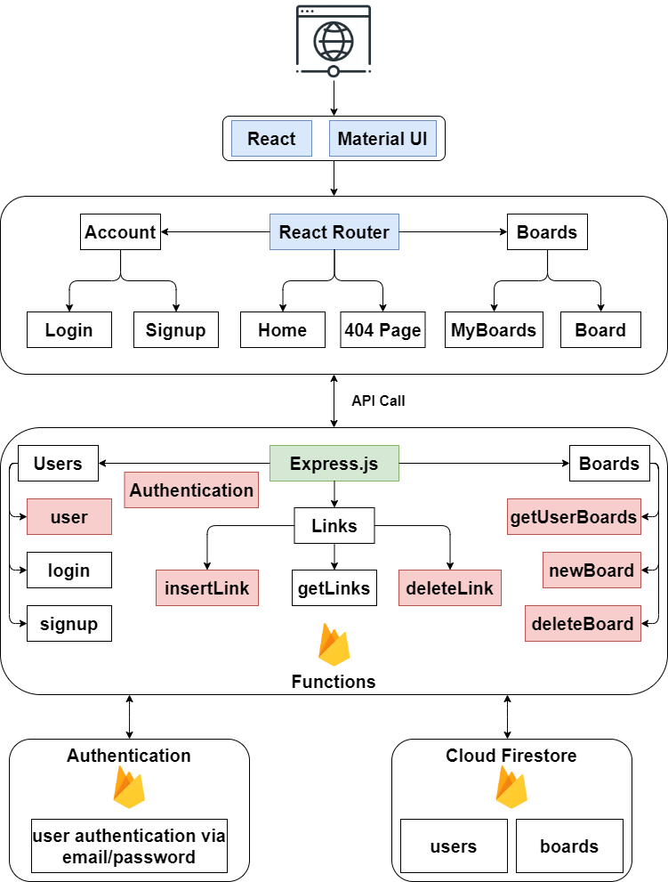

# Linkbin

Linkbin is a platform to create 'link boards' and share them with people. These 'link boards' consist of a grid of link previews; which can be viewed by anyone with a URL/boardID, but only modified by the board owner.

This project is currently hosted using [Firebase](https://firebase.google.com/products/hosting) at [linkbin-aea9b.web.app](https://linkbin-aea9b.web.app/), where you can start using this web application. The site is not optimised for mobile, so for the best viewing experience access it from a browser.

Continue reading for instructions on how to get the project up and running on your local machine.

## Summary

- [System Architecture Overview](#system-architecture-overview)
- [Frontend: React](#frontend-react)
- [Backend-as-a-Service: Firebase](#backend-as-a-service-firebase)
- [Local Development](#local-development)
- [Testing](#testing)
- [License](#license)
- [Acknowledgments](#acknowledgments)

## System Architecture Overview



## Frontend: React

Since I had to learn these Frontend frameworks, my two main considerations/requirements for the frontend were to showcase what I had learnt and to create a simple, yet useful web application.

The frontend is arguably the most important component of Linkbin as it will be it's simplicty that will make it stand out from similar web applications. The frontend is statically hosted on Firebase and is supported by a series of REST APIs. The frontend communicates with the backend through various asynchronous calls to a REST API server which returns data to display and add functionality to the website (i.e. boards, link previews, user information).

### Tech Stack

The frontend tech stack consists of:
- [React](https://reactjs.org/) - A JavaScript framework that is easy to learn but difficult to master.
- [Material-UI](https://material-ui.com/) - A popular React UI framework used to create websites with a Material Design.
- [React Router](https://reactrouter.com/) - A React library for declarative routing, extremely useful for multi-page sites.

*NOTE: Since React seems to be shifting towards a wide adoption of functional components I have opted to use them rather than the traditional class components.*

### Folder structure

The frontend code resides in the **views/** directory of the repository. This folder contains the following important files:
- **public/** - Contains the index.html file, where the built React code gets injected.
- **src/** - Contains React code. On deployment, this folder is compiled into plain JavaScript so the website can be statically served.
- **jsconfig.json** - Default configuration file for JavaScript projects. This will eventually replace **.env** for managing JavaScript projects. See [documentation](https://code.visualstudio.com/docs/languages/jsconfig) on how to modify this file.

*Note: The `baseUrl` field in **jsconfig.json** allows us to import files using their absolute paths from **src/**. This is very useful since our directory tree is fairly deep.*

Now, looking specifically at the React files in **src/**:

```
src
├── (app)
├── components
│   ├── (board-card)
│   ├── (input-box)
│   ├── (link-card)
│   └── (sidebar)
├── routes
│   ├── (board)
│   ├── (home)
│   ├── (login)
│   ├── (my-boards)
│   ├── (not-found)
│   └── (signup)
├── utils
│   ├── apiClient.js
│   ├── constants.js
│   └── session.js
├── index.css
├── index.js
├── serviceWorker.js
└── setupTests.js
```

Names in brackets represent React component folders containing 3 files:
- **component-name.jsx** - File containing functional component.
- **component-name-style.jsx** - File containing CSS styles defined as a JavaScript object.
- **index.jsx** - This file simply exports the component declared in *component-name-style.jsx*. Having this file present means that when we import this module we can reference the directory rather than the **.jsx** file. E.g. `routes/home` instead of `routes/home/home.jsx`.

Additionally, the folders group components by role:
- **(app)** - Higher-most React component in the DOM. This *component* is directly injected into `index.html`.
- **components/** - Contains reusable components that do especific things.
- **routes/** - Contains non-reusable components that handle a particular *Route*.
- **utils/** - Contains helper JavaScript functions and variables.

## Backend-as-a-Service: Firebase

Firebase is a platform developed by Google for creating web applications. It provides an array of development services to meet all webdev needs. For this project, I have used a backend-as-a-service model in Firebase.

### Tech Stack

The frontend tech stack consists of:
- **[Authentication](https://firebase.google.com/products/auth)** - A Firebase service that provides easy sign-in with any platform. For Linkbin, the only sign-in method I have enabled is *email/password*. This component will provide [JWT](https://jwt.io/) tokens to authenticated users, which will be verified during secured API requests.
- **[Cloud Firestore](https://firebase.google.com/products/firestore)** - A Firebase service that provides a NoSQL document database to easily store, sync, and query data. This database stores 2 collections: *boards* and *users*.
- **[Cloud Functions](https://firebase.google.com/products/functions)** - A Firebase service that provides a sandbox to write a backend in JavaScript. This component hosts a REST API written in [Express](https://expressjs.com/) that interfaces with the *Cloud Firestore* and *Authentication* services to send data to the frontend.

### Folder structure

Since *Cloud Functions* is relaying requests between the frontend and the database, the backend code just deals with this.

The backend code resides in the **functions/** directory of the repository. This folder contains the following important files:
- **apis/** - Contains API endpoint handler functions. These are grouped by role into: *boards*, *links* and *users*.
- **utils/** - Contains various JavaScript helper functions to deal with authentication, validation, error handling and setup.
- **index.js** - Default configuration file for JavaScript projects. This will eventually replace **.env** for managing JavaScript projects. See [documentation](https://code.visualstudio.com/docs/languages/jsconfig) on how to modify this file.

A `config.js` file located in **utils/** contains a set of variables and keys to configurate the Firebase SDK required for *Authentication*. This step will only need to be done once. Note that this file is not git-tracked so you will need to create it in order to run the backend.

*Note: `config.js` gets imported by **apis/users.js**. Check out that file to see how to initalize the Firebase app with these variables.

## Local Development

These instructions will get you a copy of the project up and running on your local machine for development and testing purposes. You can choose to either:

- Develop on the frontend. You can modify or create a new frontend all together that connects to the API endpoints currently hosted on Firebase.
- Clone the functionality of this project to your own Firebase project. To do this you would need to start a [new Firebase Project](https://console.firebase.google.com/) and enable *Authentication*, *Cloud Functions* and *Cloud Firestore*.

### Prerequisites

[NodeJS](https://nodejs.org/en/) is needed since this whole project is written/compiled-to in JavaScript. Find more information on how to download and install it on your machine on [here](https://nodejs.org/en/download/).

Once NodeJS has been downloaded and installed, check by your installation by running the command in your terminal:

``` script
node --version
```

Additionally, [Yarn](https://classic.yarnpkg.com/en/) will be used to run a local server to develop or host the frontend. Find more information on how to install it [here](https://classic.yarnpkg.com/en/docs/install/).

Once that's done, clone the repo.

``` script
git clone git@github.com:sergiomercado19/linkbin.git
```

### Setting up environment variables

If you are developing on the frontend, you need to ensure that the `URL` and `API_URL` variables from the **views/src/utils/constants.js** are pointing to your development environment or the live Firebase project.


However, to interact with the *Authentcation* service of Firebase you must configure the `config.js` file located in **functions/utils/**. The contents of this file can be located after navigating to `Project Settings > General` on the project's Firebase dashboard and registering the app. Below is a template for this file:

```js
// config.js

module.exports = {
  apiKey: "..........",
  authDomain: "..........",
  databaseURL: "..........",
  projectId: "..........",
  storageBucket: "..........",
  messagingSenderId: "..........",
  appId: "..........",
  measurementId: ".........."
};
```

### Installing

To run the frontend, from the **views/** directory execute the following commands:

```script
yarn install
yarn start
```

After the last command finishes a browser window should open automatically and take you to a `localhost` URL.

To run the backend, from the repository root ( **/** ) directory execute the following command to install [Firebase CLI](https://firebase.google.com/docs/cli):

```script
npm install -g firebase-tools
```

Now, execute the following command to login to Firebase. This will open a browser window and ask you to sign in using the account where you have create the project already:

```script
firebase login
```

Finally, by executing the last command you can follow the on-screen instructions to setup the services you need:

```script
firebase init
```

## Testing

Since this webapp was constructured under a time constraint, I didn't employ test-driven development. The test units will be added on a later minor update.

## License

This project is licensed under the MIT License - see the [LICENSE.md](LICENSE.md) file for details

## Acknowledgments

- Thanks to [Charles Stover](https://medium.com/@Charles_Stover) for a very informative document on [optimal file structure for React applications](https://medium.com/@Charles_Stover/optimal-file-structure-for-react-applications-f3e35ad0a145).
- Thanks to [Hoya Lee](https://github.com/hxyalee) for a [Backend workshop on Firebase](https://youtu.be/e02tDCwcGdE).
